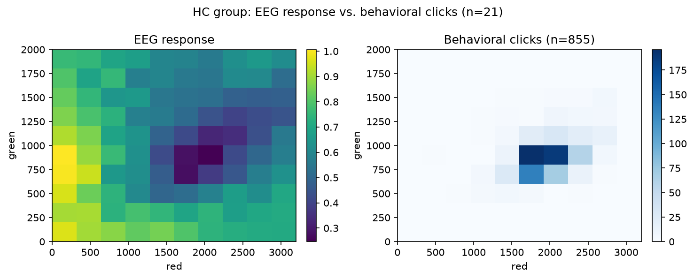
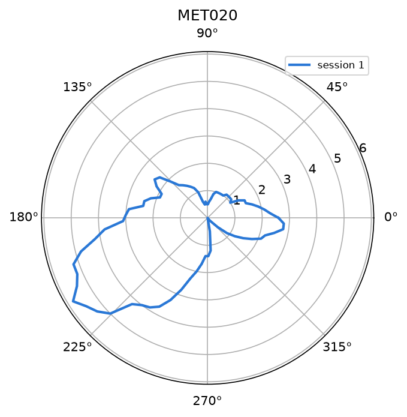

# Experiment summary

Reference for the experiment behind all three data modalities in this repo.
Source: `docs/ExperimentalContext` (the researcher's own notes, 2026-08-21)
plus what the `beh/`, `ssveps/`, and `standardizedScores/FM100/` codebases
already encode about each pipeline. Kept here so a future session doesn't
have to re-derive the connections between the three data modes from
scratch.

## Purpose

Validate a custom visual stimulator as a clinical tool for assessing color
vision deficiency (CVD). Currently testing congenital CVD (protan/deutan);
aiming to extend to acquired CVD (e.g. Parkinson's disease, PD, already
partly represented in the data). A recurring secondary question: can subtle
color-vision loss be detected even in nominally healthy controls (HC), as a
continuous trend rather than a strict CVD/not-CVD split.

## The shared physical stimulus

Both the behavioral and EEG tasks present the **same visual stimulus**: a
single light source alternating at 10 Hz between a fixed yellow LED
at 2400 D/A units (~450 lux) and a variable combination of red + green LEDs. Red ranges
0-3200 D/A units (~675 lux), green 0-2000 D/A units (~675 lux) -- these are
exactly `beh/`'s and `ssveps/`'s shared axis ranges and the canonical
`ssveps` 10x10 grid (`ssvepBeh/templateCode/grid_mapping.py`'s
`DEFAULT_RED`/`DEFAULT_GREEN`). When the red+green mix matches the yellow
in perceived color, the alternation stops looking like a flicker -- this
match point is the experiment's central construct, called the **metamer**
throughout.

*The same 10x10 red/green stimulus grid, read two ways, for the 21 HC
subjects with both tasks. Left: mean EEG response, lowest (darkest) near
red ~2100 / green ~900. Right: where the same group's behavioral clicks
land -- concentrated in almost the same region. Two independent measures of
the metamer, agreeing. Regenerate with `uv run python docs/make_figures.py`.*

## The three data modalities

| Modality | Task | What it measures | Code |
|---|---|---|---|
| **Behavioral (manual)** | Participant freely adjusts red/green until the flicker disappears, presses a button, repeats ~20x (offset-randomized each trial so they can't just return the dial to the same spot) | Direct report of the metamer point: a (red, green) click | `beh/` |
| **EEG (SSVEP grid)** | Fixed 10x10 grid of red/green combinations shown in sequence, 100 trials/run, 3-4 runs, 3s stimulus + 0.75s ISI each | Steady-state visual evoked potential (SSVEP) amplitude at each grid point -- minimal near the metamer, since a true color match produces the least "flicker" signal for the brain to phase-lock to | `ssveps/` |
| **Standardized score (FM100)** | Clinical hue-ordering test, 85 caps, independent of the custom stimulator | TES/PES/VKS error metrics -- an established, validated CVD measure to calibrate the other two against | `standardizedScores/FM100/` |

*The FM100's own standard visualization, unrelated to the custom
stimulator's red/green grid above: 85 caps arranged in a circle, radius =
placement error at that cap. Shown for one subject (MET020, session 1) --
`docs/findings.md` section 1 shows the same diagram averaged per group.*

Behavioral and EEG are testing for the same thing (the metamer) two
different ways: a direct behavioral click vs. an indirect neurophysiological
minimum. FM100 is an independent, pre-validated reference standard that
doesn't use the custom stimulator at all.

## Test-retest reliability

A recurring theme across all three modalities and already implemented in
`ssveps/` (M5, M9: per-pixel ICC, `feature_icc`,
`minimum_detectable_effect`): the researcher's stated broader goal is
whether any of this is repeatable enough to become a clinical test, not
just whether a single-session effect is significant.

## Cross-modality questions (the researcher's stated priorities, in order)

Both are now implemented; `docs/findings.md` has the results.

1. **FM100 vs. behavioral, and FM100 vs. EEG** -- explicitly called "the
   more pressing issue" in `docs/ExperimentalContext`, including whether
   HC participants show any FM100-correlated trend in the other two
   measures even without a CVD diagnosis. Implemented in `ssvep_beh_fm100/`
   (`PLANssvep_bh_fm100.md` M1-M3): a severity test (CCA) and a type/axis
   test (circular correlation) against behavioral, then EEG, then all three
   jointly. See `docs/findings.md` section 5.
2. **Behavioral vs. EEG** -- has been examined before (per the researcher's
   note) and is implemented in `ssvepBeh/` (`PLANssvepvsBeh.md` M1):
   `overlap.py` maps a participant's scattered behavioral clicks onto the
   EEG's fixed 10x10 grid (`closest_grid_indices`) and runs two independent
   permutation tests for whether the behavioral click density and the EEG
   response map overlap more than chance. See `docs/findings.md` section 4.

## Existing per-subject building blocks each pipeline already provides

- `beh/`: per-subject/group (red, green) click clouds and centroids
  (`comparisons.group_points`), PCA shape features -- orientation, spread,
  tightness (`features.py`, M2/M3). Notably, `orientation_deg` separates
  protan from deutan perfectly (p=0.0003) -- see
  `project_beh_m2_shape_features_finding` memory.
- `ssveps/`: per-subject/group normalized 10x10 response grids
  (`analysis.mean_grid`/`group_grid`), trough location (argmin and
  parametric `ramp_gaussian` fit), `ramp_slope_red` (defined for every
  subject, unlike the trough fit).
- `standardizedScores/FM100/`: per-subject/session TES, PES_RG/PES_BY, VKS
  ellipse metrics (`scores.build_scores`).
- `ssvepBeh/`: per-group behavioral/EEG spatial overlap tests
  (`overlap.py`) and individual-differences feature correlations
  (`correlation.py`).
- `ssvep_beh_fm100/`: per-subject severity (`{TES, VKS_MajRad, VKS_MinRad}`)
  and type/axis (`VKS_Angle`) FM100 features, reusable against any other
  pipeline's own severity/type feature pair (`severity.py`, `type_axis.py`).

Every pipeline shares the same `sub_id`s and the same `group`/`subgroup`
taxonomy (CTR/PD/CVD, protan/deutan within CVD), looked up live from
`ssveps/files/metadata.csv` as the single source of truth -- `beh/` and
`standardizedScores/FM100/` both do this rather than keeping their own copy.
