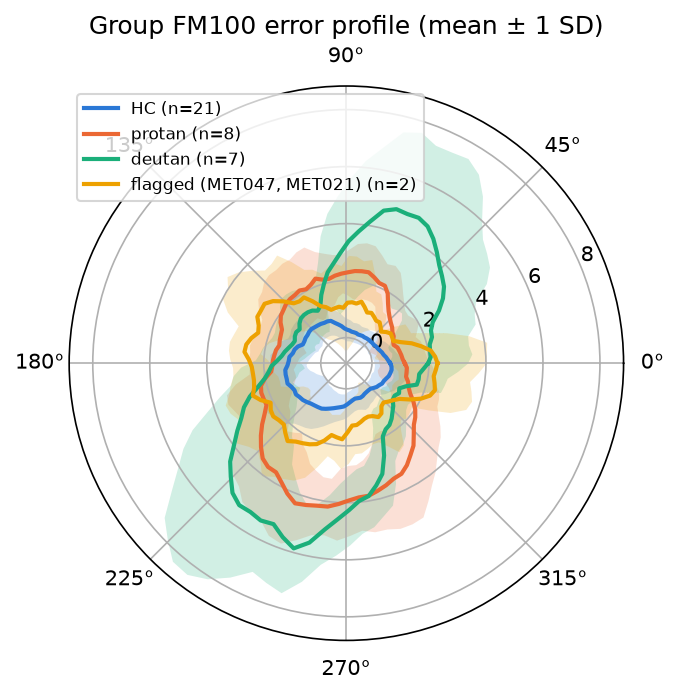
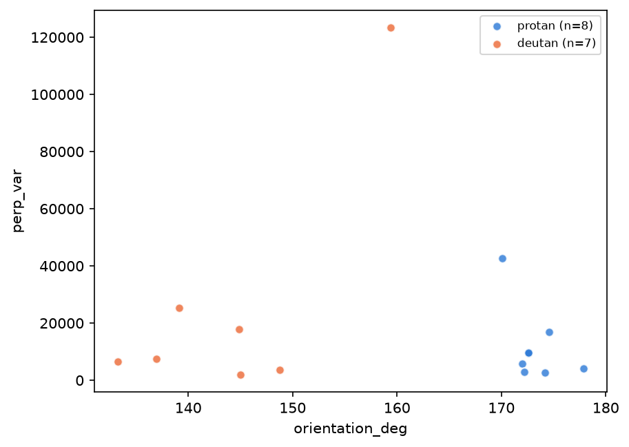
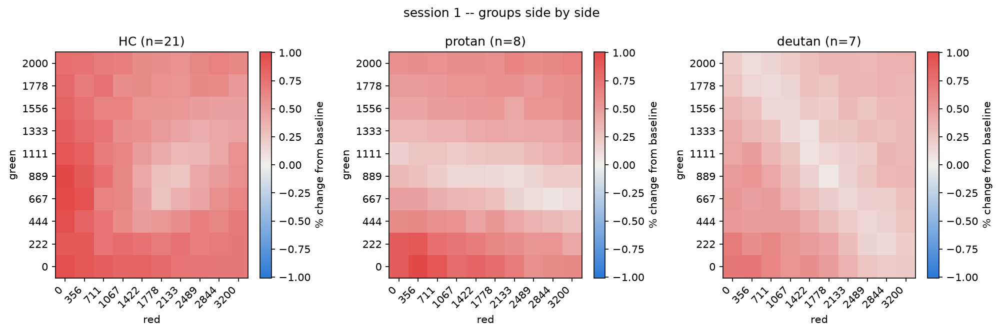
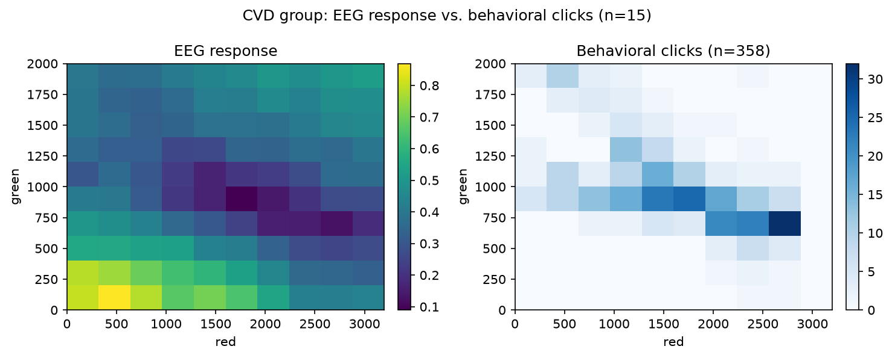
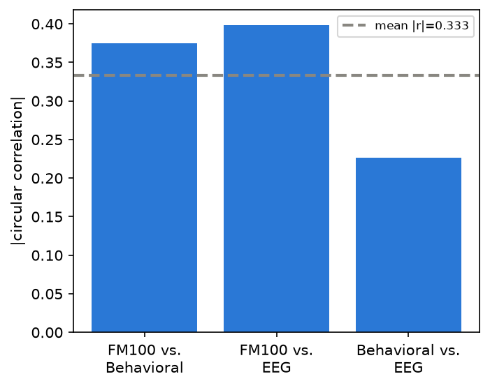

# Findings so far

Hi! This is a guided tour of everything we've learned from the color-vision
data so far, across all five ways we've looked at it. Nothing here is final
-- the point of this document is to give you a readable map of where things
stand today, with a direct link to the notebook behind every claim, so you
can open any of them, poke at the parameters, and push the story further
yourself. Treat every number below as an invitation to go check it in
context, not a conclusion to take on faith.

For the experimental background (what the stimulus is, why we're comparing
these particular measures), see `docs/experiment_summary.md`. This document
assumes that context and focuses on what we've actually found.

The figures below are generated straight from the raw data, same as every
number quoted around them -- `uv run python docs/make_figures.py`
regenerates all of them (here and in `docs/experiment_summary.md`) if the
underlying data or analysis changes.

## The shape of the project

Several ways of looking at the same underlying question -- does someone
have a color vision deficiency, and if so, which kind and how severe:

1. **`standardizedScores/FM100/`** -- the Farnsworth-Munsell 100 Hue test, a
   validated clinical reference standard, independent of our own stimulator.
2. **`beh/`** -- our stimulator's behavioral (manual match) task: participants
   click the (red, green) mix that looks the same as a fixed yellow.
3. **`ssveps/`** -- our stimulator's EEG task: the same physical judgment,
   measured indirectly via brain response across a 10x10 grid of red/green
   combinations.
4. **`ssvepBeh/`** -- do (2) and (3) actually agree with each other?
5. **`ssvep_beh_fm100/`** -- does (1) encode a continuous severity spectrum
   that (2) (and eventually (3)) also picks up on?

Below, one section per piece, roughly in the order we built them.

## 1. FM100: does our data even make sense against a known clinical test?

`standardizedScores/FM100/notebooks/01_explore.ipynb`

We took the classic 85-cap hue-ordering test, rebuilt its scoring math from
a template we'd used before, and -- before trusting a single number out of
it -- checked our new code against the original template's output on all 69
real test sessions. **Every score matched bit-for-bit.** That's the kind of
boring-but-essential check that makes everything downstream trustworthy.

With that settled, the scores tell a clean, expected story: protan and
deutan participants both show the classic signature of a red-green
deficiency (their error concentrates on the red-green axis of the test, not
the blue-yellow axis). Two participants stood out as genuinely interesting
edge cases rather than noise:

- **MET047**, new to this project (no SSVEP or behavioral data yet), has a
  total error score about as high as our CVD group's average -- but unlike
  protan/deutan, their errors are *evenly* split between the red-green and
  blue-yellow axes. That's not the usual pattern, which is exactly why you
  flagged them as worth a closer look for a different kind of deficiency.
- **MET021**, currently labeled a healthy control from the SSVEP side,
  scores noticeably worse than the control average on this independent
  test -- a hint your instinct about them was onto something, even before we
  touch the other two datasets.

*Protan and deutan both balloon out along the same axis (the classic
red-green pattern), well past HC's tight center. The flagged pair
(MET047 + MET021) sits between them and HC -- consistent with an elevated
but non-red-green-specific error, exactly why they were flagged as
different-deficiency candidates rather than folded into CVD.*

Three follow-on notebooks firmed this up. `02_group_comparisons.ipynb` ran
the same magnitude/direction features across every group pair: HC vs protan
and HC vs deutan are significant on every magnitude feature (p<0.02, most
p<0.001), and the confusion-ellipse direction (`VKS_Angle`) is significant
for protan (p=0.013) but not deutan (p=0.10) -- an asymmetry that echoes
what section 5 finds in the behavioral/EEG type-axis story. Protan vs
deutan comes back with nothing significant on any FM100 feature, the same
underpowered story every protan-vs-deutan comparison in this project tells
at n=8 vs 7. `03_flagged_subjects.ipynb` is just MET020/MET047/MET021 side
by side, in both plot styles, for a closer look at the flagged pair.
`04_hc_vs_pd.ipynb` asked a sharper question: is PD's FM100 profile just
HC's, shifted by a constant? Every magnitude feature differs from HC
(TES p=0.017, PES red-green p=0.009, PES blue-yellow p=0.018, both VKS
radii p<0.02) but `VKS_Angle` doesn't (p=0.84) -- PD's error is bigger, not
differently-directed, the same magnitude-not-direction pattern
`02_group_comparisons.ipynb` already found. There genuinely is a real,
non-zero offset (c=1.04, 95% CI [0.32, 1.81], p=0.003) -- but it only
explains about half of PD's shape (R²=0.50), so "PD = HC + a number" is a
real partial description, not the whole story.

Two more checks (M3) sharpened both of those: correcting the per-feature
comparisons for testing 6 features at once (Holm) is a real, not just
procedural, tightening -- **CTR vs PD loses every feature** (smallest
corrected p is 0.052) and protan vs deutan still has nothing, though HC vs
protan and HC vs deutan both keep 11 of their significant rows. And the
offset finding survives a direct stress test: only one CTR subject
(MET020, already flagged elsewhere in this section) is an outlier on most
of the 6 features, and dropping them barely moves the offset (1.04 to
1.11) or its R² (0.50 to 0.47) -- "PD = HC + a number" isn't riding on one
unusual control.

## 2. Behavioral: what your own clicks say

`beh/notebooks/01_explore.ipynb`, `02_shape_features.ipynb`, `03_centroids.ipynb`

This is where the story gets exciting. The first pass (M1) just compared
each group's average click location, and every comparison came back
significant -- including protan vs. deutan (p=0.0042), which is a *cleaner*
split than the EEG task manages on its own best measure (p=0.44). That
alone was worth noting: a direct behavioral report of "this looks the same
color to me" turns out to be a sharper instrument than the indirect neural
signal, at least for telling the two CVD subtypes apart.

Then M2 asked a better question: instead of just *where* someone's clicks
center, what does the *shape* of their click cloud look like? We fit a line
through each person's clicks (PCA) and measured three things about it: which
way it points, how far the clicks spread along it, and how tight they are
around it. The orientation of that line turned out to be remarkable:

> **`orientation_deg` separates every single protan participant from every
> single deutan participant, perfectly** (p=0.0003, and the effect size is
> literally the maximum possible -- every protan subject's line points one
> way, every deutan subject's points another). That's the single strongest
> finding of the whole project so far.

*Every subject reduced to two numbers: which way their click cloud points
(x) and how tightly the clicks hug that line (y). The x-axis alone fully
separates the two colors -- no protan point falls to the left of any deutan
point.*

M3 turned this into pictures: plotting each subject's own centroid, and
each group's centroid with error bars, makes the same story visible at a
glance -- protan and deutan's line orientations sit in two completely
separate, tight clusters, while deutan turns out to be the least
internally-consistent group we have (its subject-to-subject spread is
roughly double every other group's, on both the raw clicks and the shape
features).

Three more notebooks tested how far that story holds up.
`04_reliability.ipynb` asked whether it's stable session-to-session (HC and
PD only -- CVD is excluded, most protan/deutan subjects have just one
session). For HC, mostly not: of centroid location and the three M2 shape
features, only `centroid_green` clears significance (ICC=0.60, p=0.0013);
`orientation_deg`, `along_var`, `perp_var`, and `centroid_red` don't. That
doesn't undercut M2's headline result -- that used clicks pooled across a
subject's sessions, a more forgiving question -- but it's a real caveat
before trusting any single session's numbers on their own. `05_hc_vs_pd.ipynb`
reran the M1 comparison on HC vs PD specifically (Hotelling p=0.0001,
matching M1; all three shape features individually significant too) and
found something new: PD subjects are significantly less consistent within
a single sitting (Mann-Whitney p=0.023, ~70% more within-session click
scatter than HC, 552 vs 320) -- a specific, confirmed answer to whether
PD's motor symptoms show up as noisier clicking. `06_outlier_rejection.ipynb`
added ellipse-based outlier detection (per-subject and per-group) and ran
it everywhere: flagged fractions come back similar and unremarkable across
every group (10.5%-15.5% of clicks) -- an honest "nothing alarming" result,
not grounds for adding automatic filtering to the pipeline.

## 3. EEG (SSVEP grid): the harder, indirect measure

`ssveps/notebooks/` -- start with `08_cvd_gamut.ipynb`, `09_variance_components.ipynb`,
`10_gain_shape.ipynb`, `11_reliability_outcomes.ipynb`, and `12_pca.ipynb` for the
headline work; `docs/ssvep_summary.md` has the full history including two
real bugs we found and fixed early on (an axis-swap and a permutation
subsampling issue -- worth knowing about if you're ever surprised by an old
number).

The EEG task is where things get harder, because the signal is indirect and
noisier than a button press. What holds up well:

- **CVD vs. healthy controls is a strong, reliable effect.** Whether a
  subject's response "trough" fit runs off the edge of what we sampled
  predicts CVD with 73% sensitivity / 81% specificity (p=0.0019).
- **Protan vs. deutan is a real but stubborn question.** Three independent
  angles on the EEG data -- a shallower response ramp, a residual pattern
  right at the trough after removing overall response strength, and the
  first principal component of the whole grid -- all point the same
  direction, but none individually reaches statistical significance at our
  current sample size (n=7-8 per subtype). This is consistent with, and
  motivated, the reliability work below.
- **Reliability matters, and it changed our recommendations.** When we
  checked which EEG measures are actually consistent test-to-retest, the
  ramp slope and overall gain of a subject's response turned out to be
  *more* trustworthy (ICC 0.85-0.90) than the measure we'd started with,
  trough depth (0.76) -- and one early candidate measure was so unreliable
  (ICC 0.18) it's not usable at all. Good news buried in this: this is
  exactly the kind of check that keeps us from building a clinical claim on
  a number that just happens to be noisy.

*The same red/green grid as every other figure here, but now the EEG's own
response surface. HC's dip (paler patch) sits centrally, around red ~2100
/ green ~900. Protan's and deutan's pale patches both stretch toward the
grid's edge instead of sitting in the middle -- the visual version of
"CVD subjects' troughs tend to lie beyond the sampled red range."*

Four more notebooks (`13_hc_vs_pd.ipynb` through `16_grid_shape_features.ipynb`)
pushed further into the CVD subtype question, and one of them revises the
picture above. `13_hc_vs_pd.ipynb` found HC vs PD not significant on
`ramp_slope_red` (p=0.89) -- consistent with PD being underpowered
everywhere else in this project. `14_hc_vs_subtypes.ipynb` ran the same
measure three ways: HC vs protan (p=0.0019) and HC vs deutan (p=0.048) are
both significant, protan vs deutan still isn't (p=0.69) -- matching M6's
number above almost exactly. Then `15_permutation_stability.ipynb` reran
protan vs deutan 200 times at independent seeds, using the cluster-based
permutation test instead of a whole-grid scalar summary, and found **a
corrected-significant cluster in 173-196 of 200 seeds (86.5%-98%)** -- a
stable, seed-robust effect, not a fluke. This genuinely revises the "none
individually reaches significance" bullet above: protan and deutan *do*
differ significantly in the EEG data, just in a spatially localized region
(the low-red/high-green corner of the grid, protan higher than deutan
there) that a whole-grid summary like `ramp_slope_red` or PCA's PC1
averages away. It's currently the single most solid subtype signal
anywhere in the SSVEP data, and worth chasing further -- does M8's protan
trough-region residual sit in the same corner? -- before the next round of
analysis design. Last, `16_grid_shape_features.ipynb` tried a new rotated
(tilted) dip model on top of this, but too few subjects have a valid fit to
run the protan/deutan comparison yet (25% and 43% valid fits, vs 90-100%
for HC/PD) -- the model itself works, the data just isn't there yet.

## 4. Does the EEG test actually agree with what people click?

`ssvepBeh/notebooks/01_explore.ipynb`, then `02_reliability.ipynb`

This is the newest and most carefully-checked piece, because it's the one
that would actually justify using the EEG test clinically. We asked two
different questions, and got two different answers -- which is itself the
finding worth remembering.

**Do clicks land where the EEG response is lowest?** Yes, robustly. We ran
two independently-built statistical tests (deliberately different from each
other, so agreement between them means something), and **every group --
including healthy controls -- shows clicks concentrating significantly
where the EEG signal is weakest.** That's a genuinely nice result: it means
the "metamer" concept the whole stimulator is built around shows up in the
brain data even for people with no diagnosed deficiency, which is exactly
the kind of subtle trend you were hoping to find a hint of. We double-checked
this holds up across repeat EEG sessions too, and it does -- the numbers
from session 1 and session 2 are nearly identical. `04_permutation_stability.ipynb`
pushed that stability check further, rerunning the same test 200 times at
independent seeds for HC, PD, protan, and deutan: **every group stays
significant at every single seed** -- robust to the permutation RNG, not
just to which session you check. `03_clicks_on_grid.ipynb` is the picture
that makes this finding visible at a glance -- the EEG grid as a heatmap
with each participant's actual clicks scattered on top, per subject and
per group, with and without `beh/`'s M4 outlier filter. And
`05_toroidal_shift_explained.ipynb` is a from-scratch, step-by-step
walkthrough of the toroidal-shift null model itself (a synthetic 5x5 grid,
then a real subject) for anyone who wants to understand the test, not just
its output.

*The CVD group's version of `docs/experiment_summary.md`'s HC figure --
clicks (right) concentrate along the same diagonal band where the EEG
response (left) is weakest, the pattern the spatial-overlap tests confirm
statistically in every group, not just this one.*

**Does a person's EEG-measured severity track their behavioral severity?**
Here's the honest part: at first glance, yes -- your click-line orientation
(the same measure that perfectly splits protan/deutan) correlated with the
EEG's most reliable measures. But when we corrected for the fact that we'd
tested 25 different feature pairs at once, and when we checked whether the
relationship holds up across repeat EEG sessions, **it didn't survive either
check.** Rather than quietly dropping that or overstating it, we wrote up
exactly why (see `docs/ssvepbeh_reliability_gaps.md`): testing 25 separate
pairs instead of the joint pattern likely dilutes the signal, and -- this
is the sharper point -- **we currently have zero participants with deutan
who've done the EEG task twice**, so we can't even check reliability for
the comparison that matters most. That document lays out concrete next
steps (a smarter multivariate test, and how much more repeat-session CVD
data would actually help).

## 5. FM100 vs. behavioral and EEG: chasing the continuous severity spectrum

`ssvep_beh_fm100/notebooks/01_fm100_reliability.ipynb`, then `02_fm100_vs_behavioral.ipynb`

This is the project born directly from your own hunch: that FM100's score
isn't just "protan or deutan or neither," but might carry a continuous
severity signal the categorical labels throw away -- and that this signal
should show up in the behavioral data too. We learned from `ssvepBeh/`'s
mistake and built this one differently from the start: instead of testing
every FM100 feature against every behavioral feature (the approach that
diluted itself last time), we picked exactly two pre-specified questions
going in -- does overall error *magnitude* line up (severity), and does
error *direction* line up (type/axis) -- and checked FM100's own test-retest
consistency before leaning on either.

**FM100's severity features are trustworthy; its direction feature is
shakier.** Total error and the confusion-ellipse's size are highly
consistent session-to-session. Which *way* that ellipse points is not
(barely half-reliable) -- worth knowing going in, not discovering after the
fact.

**Severity: a strong signal, but likely a between-group one for now.**
Pooled across everyone, FM100 error magnitude and your behavioral spread
line up strongly (about as strong a relationship as this project has found
anywhere). But split apart by group, that relationship doesn't hold up on
its own within any single group at our current sample sizes -- most likely
because it's substantially "sicker people score worse on both tests,"
which we already knew, rather than a fine-grained continuum. Not
disproven, just not yet confirmed -- worth revisiting once we have more
participants per group.

**Type/axis: the more exciting result.** FM100's confusion-ellipse
direction and your click-line orientation line up significantly overall,
*and* that relationship holds up within the CVD group on its own -- not
just because CVD and healthy participants differ, but because CVD
participants who differ from each other in one measure tend to differ from
each other the same way in the other. That's a genuinely more convincing
kind of evidence for a real, continuous, shared signal, even though it's
riding on FM100's noisier direction feature.

### Then we extended the same two questions to the EEG data

`ssvep_beh_fm100/notebooks/03_eeg_reliability.ipynb`, then `04_fm100_vs_eeg.ipynb`

Same two pre-specified tests, same reused code, now against the EEG
measures (steepness and direction of how the brain response ramps with
red/green) instead of your clicks. **Both EEG results echo the behavioral
ones, just weaker** -- which is itself a consistent, sensible pattern: EEG
has been the noisier, more indirect measure everywhere else in this
project too.

- **Severity** lines up significantly overall, but more weakly than with
  behavioral data, and (same as before) doesn't hold up within any single
  group at our current sample sizes.
- **Type/axis** also lines up significantly overall. Within groups, only
  deutan shows a significant relationship (n=7) -- interesting, but at that
  size it's a lead worth watching, not yet as solid as the behavioral
  version's within-CVD result (n=15).

**Put together, the clearest single result across this entire line of
work is still the behavioral one**: FM100's confusion-ellipse direction
tracking your click-line orientation within the CVD group alone. The EEG
extension confirms the same underlying pattern shows up a second way, just
more faintly -- more evidence for the idea, even if the EEG signal alone
wouldn't have been convincing on its own.

### Then we asked whether all three agree at once, not just two at a time

`ssvep_beh_fm100/notebooks/05_three_way_type_axis.ipynb`

FM100, your clicks, and the EEG each give a "which way does this
deficiency point" reading. We'd tested FM100-vs-clicks and FM100-vs-EEG;
the third pairing -- your clicks directly against the EEG reading, with
FM100 out of the picture -- had never been checked. So we checked it, and
then asked the more interesting question it sets up: do all three agree
*together*, as one combined pattern, even in a case where one of the three
individual pairings comes up empty?

**The third pairing (clicks vs. EEG) doesn't hold up on its own** -- no
real relationship there in isolation. That could have been a discouraging
result. **But testing all three together anyway, as one combined
question, found a real signal** -- FM100, your clicks, and the EEG do
share structure as a group, even though one of the three ways of pairing
them up individually comes up empty. This is honestly the most compelling
piece of evidence in the whole project for your original idea: it's not
resting on one strong measurement that might be a fluke, it's a pattern
that's consistent enough across three completely independent ways of
measuring the same thing that it survives one of them not lining up
directly.

*FM100-vs-behavioral and FM100-vs-EEG each carry real signal on their own;
behavioral-vs-EEG (right bar) is the weak edge, well below the joint
statistic (dashed line) -- and still doesn't drag the joint test below
significance.*

We also spotted a new, specific lead worth keeping an eye on: within the
protan group alone, that "empty" pairing (clicks vs. EEG) actually *does*
show a significant relationship (though at only 8 protan participants,
that's a hint to chase with more data, not a settled finding yet).

## Where this leaves us

- **Solid and ready to lean on:** behavioral group separation (especially
  click-line orientation for protan/deutan), the CVD-vs-control EEG signal,
  the spatial agreement between clicks and EEG response (now also confirmed
  robust to the permutation seed, not just the session), and FM100's own
  severity features being reliably measured -- plus a real (if partial)
  constant offset between HC's and PD's FM100 profile shape.
- **A revised subtype picture, mid-project:** protan and deutan's EEG
  responses *do* differ significantly after all -- just in one specific,
  localized region of the grid rather than in any whole-grid summary
  number, and it only turned up once we tested seed-stability directly with
  a cluster-based test instead of a scalar one. It's currently the most
  solid subtype signal in the SSVEP data, and a reminder that "not
  significant" can depend on which test you reach for first.
- **Promising but not yet proven:** whether EEG severity tracks behavioral
  severity person-by-person; whether FM100's or the EEG's severity spectrum
  is a true within-group continuum or mostly a between-group difference we
  already knew about; the EEG version of the type/axis result, currently
  only significant within deutan at n=7; the new protan-specific
  clicks-vs-EEG lead from M3 (n=8); the new rotated-dip shape-feature
  comparison for protan/deutan, blocked on too few valid fits (25%/43%
  valid). All real, honestly-documented open questions, not dead ends.
- **The most convincing result across the whole project:** the three-way
  finding -- FM100, your clicks, and the EEG all agree as a group on which
  way a deficiency points, a pattern robust enough to survive one of the
  three individual pairings coming up empty. Direct evidence for your
  "masked continuous spectrum" idea holding up across three independent
  instruments at once, not just one.
- **Not yet started:** everything in this line of work now comes back to
  sample size -- more CVD/protan/deutan participants would let us actually
  test whether the severity spectrum and the three-way agreement hold up
  *within* a single diagnostic group, and would unblock the rotated-fit
  shape comparison above -- the one recurring bottleneck across every
  piece of this project.

## Come play

Every number above has a notebook behind it, and every notebook is meant to
be opened, not just read. A few easy ways to push further, if you're in the
mood:

- In any `beh/` or `ssvepBeh/` notebook, swap the `categories`/`sub_ids`
  lists for a different set of participants -- e.g. put MET047 and MET021
  side by side with protan/deutan and see where they fall.
- In `standardizedScores/FM100/notebooks/01_explore.ipynb`, try the
  `window=` smoothing parameter on a few individual participants' error
  profiles and see whose shape changes the most.
- In `ssveps/notebooks/12_pca.ipynb`, the PCA loadings are sitting right
  there as heatmaps -- worth a look even without changing anything.
- In `ssveps/notebooks/15_permutation_stability.ipynb`, look at where the
  corrected-significant cluster actually sits across a few of the 200
  seeds -- it's the most reproducible protan/deutan signal in the project
  so far, and hasn't been chased any further than "it's there."
- In `beh/notebooks/06_outlier_rejection.ipynb`, try `n_std=1.5` or `2.5`
  instead of the default 2.0 and see how much the flagged fractions move.
- Anywhere you see a `seed=` parameter, changing it re-shuffles the
  permutation test's random draws -- a good way to build intuition for how
  stable a given p-value really is.
- In `ssvep_beh_fm100/notebooks/02_fm100_vs_behavioral.ipynb`,
  `04_fm100_vs_eeg.ipynb`, or `05_three_way_type_axis.ipynb`, the
  `categories` list controls which group breakdowns get tested -- try a
  hand-picked `sub_ids` list (e.g. just protan, or MET047/MET021 again) to
  see if the severity or type/axis relationship looks any different for a
  subset you're curious about.
- `05_three_way_type_axis.ipynb`'s joint test works with any number of
  angle features, not just three -- if you ever add a fourth angle-style
  measurement to this project, `type_axis.joint_concordance_test` is ready
  for it without changes.

Nothing breaks by experimenting -- every notebook reloads its data fresh
from the raw files each time, so there's nothing to accidentally corrupt.
Go see what you find.
